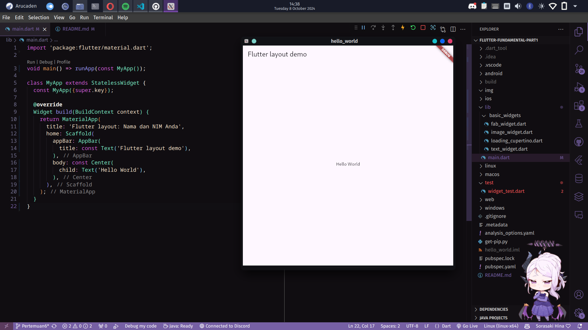

### Nama    : Daffa Maulana Satria
### NIM     : 2241720105
### Kelas   : TI-3D
<br>

# PERTEMUAN 6
## Praktikum 1
### Langkah 2


### Langkah 4
**Soal 1** 

Letakkan widget Column di dalam widget Expanded agar menyesuaikan ruang yang tersisa di dalam widget Row. Tambahkan properti crossAxisAlignment ke CrossAxisAlignment.start sehingga posisi kolom berada di awal baris.

```dart
// soal 1
child: Column(
    crossAxisAlignment: CrossAxisAlignment.start,
```

**Soal 2**

Letakkan baris pertama teks di dalam Container sehingga memungkinkan Anda untuk menambahkan padding = 8. Teks ‘Batu, Malang, Indonesia' di dalam Column, set warna menjadi abu-abu.

```dart
// soal 2
Container(
    padding: const EdgeInsets.only(bottom: 8),
        child: const Text(
            'Wisata Gunung di Batu',
            style: TextStyle(
                fontWeight: FontWeight.bold,
        ),
    ),
),
Text(
    'Batu, Malang, Indonesia',
    style: TextStyle(
        color: Colors.grey[500],
    ),
),
```
**Soal 3**

Dua item terakhir di baris judul adalah ikon bintang, set dengan warna merah, dan teks "41". Seluruh baris ada di dalam Container dan beri padding di sepanjang setiap tepinya sebesar 32 piksel. Kemudian ganti isi body text ‘Hello World' dengan variabel titleSection

```dart
    // soal 3
        Icon(
            Icons.star,
            color: Colors.red[500],
        ),
        const Text('41'),
        ],
    ),
    );

    return MaterialApp(
        title: 'Flutter layout: Daffa Maulana Satria | 2241720105',
        home: Scaffold(
            appBar: AppBar(
            title: const Text('Flutter layout demo'),
            ),
            body: Column(
            children: [titleSection],
            ),
        ),
    );
```

Hasil


## Praktikum 2


## Praktikum 3


## Tugas Praktikum 1


## Tugas Praktikum 2


